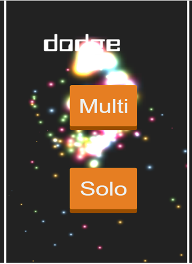
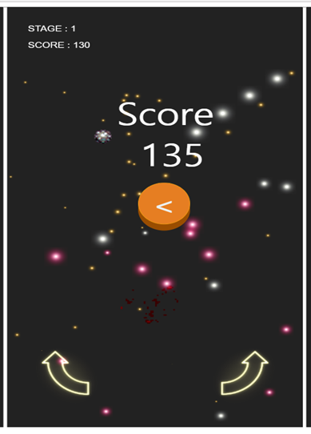

# 2018년 1학기 공개 SW 4조 RolyPoly
# Phaser 3 와 Node.js, Socket.io 를 이용한 웹게임 개발
오픈소스 HTML5 게임 프레임워크 Phaser 3 와 Node.js, Socket.io 를 이용한 멀티플레이가 가능한 웹 게임의 개발 및  
Node.js 무료 호스팅 서비스인 Heroku 를 통한 웹 페이지 호스팅
<br/><br/>

## 기존 프로젝트 분석
기존 프로젝트 : https://github.com/CSID-DGU/2017-2-OSSP-Awesome-1  
적용 라이센스 : GNU Lesser General Public License v2.1  

- 유저가 게임 실행파일을 직접 다운로드 해야 플레이 가능
- PC 에서만 게임 플레이 가능
- 멀티 플레이 시 유저가 서로의 IP 주소 를 사전에 알고 있어야 함  

이 있었고, 이를 개선하기 위해 모든 기기에서 인터넷 연결만 되어 있다면 접속만으로
바로 실행 할 수 있는 웹 게임을 개발하는 것 을 프로젝트의 목표로 설정.
<br/><br/>
  
## 프로젝트 설명
기존 프로젝트 분석 및 한계점 도출, 이를 개선하기 위해  
오픈소스 HTML5 게임 프레임워크 인 Phaser 3 를 이용하여 웹 브라우저에서 접속만으로 실행할 수 있는 웹 게임을 개발  
Node.js 와 Socket.io 를 이용하여 플레이어 간 실시간 데이터 통신을 통한 멀티플레이 게임으로의 확장  
Node.js 무료 호스팅 서비스인 Heroku 를 이용한 웹 사이트 호스팅 및 배포
<br/><br/>
## 게임 플레이
- https://phaser-hosting.herokuapp.com/main
<br/>


<br/><br/>

## 게임 실행 방법
프로젝트 전체를 다운로드 후 Node.js v8.9.1 및 npm 설치 후 프로젝트가 설치된 디렉토리로 이동  
```
npm start
```
를 입력하면 package.json 안의 의존성 모듈 설치 후 Server.js 실행  
이후 http://127.0.0.1:3000/main 으로 접속하면 게임 플레이 가능
<br/><br/>

## 사용한 라이브러리 및 라이센스, 버젼
- Phaser 3  : MIT license    v3.4.0  
- Node.js   : Apache-2.0     v8.9.1  
- Socket.io : MIT license    v2.1.1  
- JQuery    : GPL-2.0+, MIT  v1.7.1 <br/>
## 팀원
김인제(팀장, 게임 기획 및 개발) 2014112049 helios789@naver.com
<br/><br/>
김형우(서버 개발) 2014112048 hwjw9599@naver.com
<br/><br/>
장현석(웹 Front End 개발 및 호스팅) 2014112067 gustjr1259@dongguk.edu
<br/><br/>
## 디렉토리 구조
```
Project<br/>
|server.js        서버 실행파일
|----public       게임 실행에 필요한 파일  
     |----assets  게임 실행에 필요한 이미지
     |----js      게임 소스코드
 ```
<br/><br/>
## 기타 오류 해결방법
자바스크립트 ES6 사용으로 인해 Chrome 브라우저 에서의 사용 권장<br/>
기타 문의사항 발생 시 팀장 : 김인제 helios789@naver.com 로 문의
